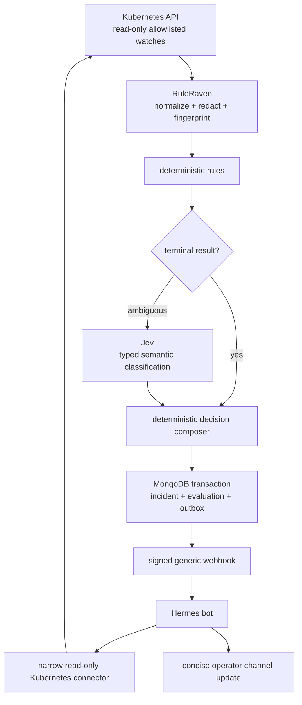

# Use case: Jev classification with Hermes incident investigation

This case history describes an Alpha deployment pattern that combines RuleRaven,
TypeSafe Jev, and a Hermes bot. It uses generic names and synthetic examples; no
cluster identifiers, credentials, private endpoints, customer data, or personal
details are included.

The central design choice is separation of responsibility:

- **RuleRaven** continuously observes Kubernetes, creates stable incident state,
  and owns deterministic policy.
- **Jev** supplies a narrow semantic classification only when deterministic rules
  cannot decide the case.
- **Hermes** is an optional external notification consumer that gathers bounded
  live evidence and writes a short operator-facing assessment.

Hermes is not required to run RuleRaven. The same signed webhook can be consumed
by n8n, an incident-management platform, a ticketing system, or a custom service.

## The problem

Kubernetes produces many noisy and short-lived signals. Sending every Event or
workload update directly to a general-purpose model is expensive, inconsistent,
and difficult to audit. Sending every raw alert to a human merely moves the noise.

This deployment needed to:

1. observe a namespace without changing it;
2. identify known failure and recovery patterns deterministically;
3. classify only genuinely ambiguous observations with a low-cost model;
4. deduplicate repeated observations into stable incidents;
5. persist the decision and notification intent atomically;
6. notify an external bot without coupling RuleRaven to that bot; and
7. let the bot verify current state without giving webhook content a general
   shell.

## Architecture

<!-- markdownlint-disable MD013 -->



<!-- markdownlint-enable MD013 -->

The AI components do not control the workflow. RuleRaven decides when Jev is
needed, validates its typed response, and composes the final incident decision in
code. Hermes receives the completed decision after it has been persisted.

## 1. Use deterministic rules before Jev

RuleRaven handles clear operational conditions without a provider call. Examples
include crash loops, image-pull failures, unschedulable Pods, failed Jobs,
unavailable workloads, Warning Events, suppression, stability, and recovery.

Only an ambiguous observation reaches the configured decision provider. A typical
Alpha configuration pins Jev rather than following a moving alias:

```yaml
decision:
  primary:
    type: openrouter
    model: typesafe/jev-1.13
    existingSecret:
      name: ruleraven-credentials
      key: provider-api-key
```

The credential remains in a Kubernetes Secret. RuleRaven sends Jev a bounded,
normalized, redacted snapshot rather than the original Kubernetes object.

Jev returns typed answers for the semantic dimensions RuleRaven needs. It does not
write the incident narrative, execute commands, or authorize remediation. The
deterministic composer remains authoritative and prevents provider evidence from
downgrading a deterministic critical result.

This keeps continuous triage economically practical: known cases are software
branches, while Jev is reserved for the small semantic gap ordinary rules cannot
reliably cover.

## 2. Deliver through a provider-neutral webhook

After composing a decision, RuleRaven commits the incident, evaluation, immutable
snapshot, and notification outbox entry in one MongoDB transaction. The outbox
dispatcher then sends an at-least-once HTTPS webhook.

The webhook is intentionally consumer-neutral. A receiver must:

- verify the HMAC signature over the exact raw body;
- enforce a short timestamp window;
- deduplicate deliveries by the RuleRaven event ID;
- limit request size and processing time; and
- treat every payload field as untrusted data after signature verification.

A valid signature authenticates the sender and body. It does not make a
Kubernetes Event message safe instructions for an agent.

## 3. Use Hermes as an optional investigator

In this deployment, a Hermes bot receives the signed webhook and posts the result
to an operator channel. The bot is deliberately outside RuleRaven:

- RuleRaven remains useful when Hermes is absent.
- Hermes can be replaced without changing controller logic.
- The notification contract stays suitable for non-agent consumers.
- Bot credentials and channel configuration never enter RuleRaven.

A concise route prompt asks Hermes to report only:

- the current live state;
- the most likely cause supported by evidence; and
- the safest next action, if any.

Healthy recovery notifications are limited to a few lines. Active incidents may
use a slightly larger budget, but command dumps, generic caveats, speculative
cause lists, and repeated payload fields are omitted.

A synthetic recovery can therefore produce an update like:

```text
✅ Resolved — the watched workload is healthy.
- Live: 1/1 desired replica is ready and available.
- Action: Record the recovery; no cluster change is needed.
```

## 4. Do not give webhook sessions a general shell

Hermes correctly restricts webhook-triggered sessions by default because webhook
payloads can contain attacker-controlled text. Enabling an unrestricted terminal
for a webhook route would let a crafted alert attempt command injection with the
bot's host credentials.

Instead, this deployment exposes a dedicated read-only Kubernetes connector to
that route. Its contract is intentionally smaller than `kubectl`:

- allowlisted namespaces only;
- Pods, Events, Deployments, StatefulSets, DaemonSets, and Jobs only;
- sanitized resource status and conditions;
- bounded namespace-health summaries;
- bounded related Events;
- optional, redacted searches of RuleRaven's own controller logs;
- no Secrets, ConfigMaps, arbitrary workload logs, manifests, environment values,
  pod exec, port forwarding, or mutation methods.

The webhook route receives only this connector's toolset. It does not receive the
terminal, filesystem, browser, or general code-execution toolsets.

An illustrative Hermes dynamic subscription looks like this:

```json
{
  "ruleraven-incidents": {
    "description": "Concise live RuleRaven incident triage",
    "secret": "<shared HMAC secret>",
    "prompt": "Verify the minimum live evidence and report a concise verdict.",
    "toolsets": ["mcp-ruleraven-k8s"],
    "deliver": "discord"
  }
}
```

The connector is an operator-controlled integration, not a capability granted by
RuleRaven. Its backend identity must still be scoped and audited independently.
If cluster-level authorization unexpectedly grants broader permissions, the
connector must continue enforcing its own resource, namespace, field, and method
allowlists.

## 5. Handle ephemeral Events without declaring failure

Kubernetes Events expire and can disappear before an investigator reads the
notification. A missing Event is therefore evidence to interpret, not a reason to
stop the investigation.

For an Event-based recovery, Hermes follows a bounded fallback:

1. request the named Event;
2. if it has expired, inspect the allowlisted namespace health summary;
3. optionally search RuleRaven controller logs using the incident or evaluation
   identifier; and
4. report whether the current workload state supports the recovery decision.

The bot does not restart a workload merely because an Event vanished. RuleRaven
and the external investigator remain read-only.

## What the Alpha exercise proved

The deployment exercised the complete path with synthetic incidents:

- Kubernetes informer observation;
- deterministic and ambiguous decision paths;
- pinned Jev classification;
- MongoDB transaction and outbox persistence;
- signed webhook delivery;
- Hermes receipt and bounded live verification;
- recovery handling when the original Event had expired; and
- concise delivery to an operator channel.

This is integration evidence, not a production-readiness claim. RuleRaven remains
Alpha, and every target environment needs its own RBAC, network, provider,
retention, webhook, and failure-mode review.

## Reuse checklist

Before adopting this pattern:

- [ ] Start with one non-production namespace and synthetic incidents.
- [ ] Pin the Jev model used to calibrate decision thresholds.
- [ ] Keep deterministic rules authoritative over provider output.
- [ ] Store provider, MongoDB, and webhook credentials outside committed files.
- [ ] Use a MongoDB replica set so incident and outbox writes are transactional.
- [ ] Verify effective Kubernetes permissions, not only rendered chart RBAC.
- [ ] Verify webhook signatures before parsing and deduplicate every delivery.
- [ ] Keep Hermes or another agent optional and external.
- [ ] Give webhook-triggered agents narrow structured tools, never a general shell.
- [ ] Bound and sanitize connector responses before returning them to the model.
- [ ] Cap notification length and define a shorter recovery format.
- [ ] Clean up synthetic fixtures so they do not become permanent alert noise.
- [ ] Test expired Events, duplicate deliveries, provider failure, and receiver
      downtime.

## Variations

The same RuleRaven webhook supports simpler integrations:

- **n8n workflow:** verify and deduplicate the signed request, route by severity,
  then create a ticket or send a chat notification.
- **Incident platform:** map the stable event ID to an alert deduplication key and
  close the alert on a recovery transition.
- **Archive-only receiver:** retain validated decisions for audit without invoking
  another model.
- **Custom SRE service:** enrich the incident through an internal read-only API
  and apply organization-specific escalation policy.

These integrations should consume the generic notification contract rather than
adding consumer-specific behavior to RuleRaven.

## Related documentation

- [RuleRaven architecture and safety boundaries](../../README.md#architecture)
- [Safe Alpha test deployment](../operations/test-deployment.md)
- [Security policy](../../SECURITY.md)
- [Hermes webhook documentation](https://hermes-agent.nousresearch.com/docs/user-guide/messaging/webhooks)
- [TypeSafe Jev documentation](https://docs.typesafe.ai/)
